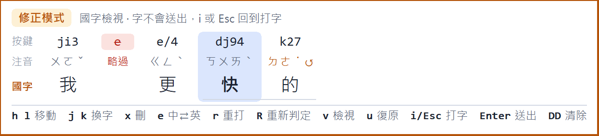

<div align="center">

# 順打輸入法

**中文和英文順著打下去就好，不用切換。**
Windows 10 / 11 的注音＋英文混打輸入法

[**下載安裝檔**](https://github.com/ChouYangEn0401/shunda-ime/releases/latest) ·
[專案首頁](https://chouyangen0401.github.io/shunda-ime/) ·
[按鍵表](docs/keys.md) ·
[安裝說明](docs/install.md) ·
[給工程師](CONTRIBUTING.md)

</div>

---

注音和英文混在同一句裡直接打。字母先出現、旁邊提示注音，按聲調鍵才變成中文。
每按一鍵都把整段重新解碼一次，所以**注音打反、快打多按的雜鍵、中英誤判**，
是在同一個判斷裡一起處理掉的，而不是事後補救。

```
按鍵   ji3    e      e/4    dj94    k27      python
注音   ㄨㄛˇ  略過    ㄍㄥˋ  ㄎㄨㄞˋ  ㄉㄜ˙↺   英文
國字   我             更     快      的       python
            ↑ 多按的鍵被略過        ↑ 順序打反，讀成 ㄉㄜ˙
```

這張表不只是說明圖——組字中按 <kbd>Esc</kbd> 就會出現，而且可以直接在上面改字。

<p align="center">
  
</p>

---

## 往哪裡走

| 你是 | 從這裡開始 |
|------|-----------|
| 想知道這是什麼 | [**專案首頁**](https://chouyangen0401.github.io/shunda-ime/) — 五個畫面看完整個輸入法在做什麼 |
| 想裝來用 | [**安裝說明**](docs/install.md) — 一個安裝檔，不用先裝 Python 或 PIME |
| 已經在用 | [**按鍵表**](docs/keys.md) — 打字、選字、修正模式、標點四種按法 |
| 想改它 | [**CONTRIBUTING.md**](CONTRIBUTING.md) — 環境、測試、重現 bug、出版本 |
| 想懂它怎麼想 | [**docs/architecture.md**](docs/architecture.md) — 解碼器、session、PIME 協定，和每個決定的理由 |
| 想散佈它 | [**docs/licenses.md**](docs/licenses.md) · [NOTICE](NOTICE) — 詞庫、元件各自的授權 |

---

## 它會做什麼

**打字**　不用切換中英．注音順序打反也認得（`k27` → 的）．快打多按的鍵會被略過，
而且救得回來．空白就是你的分隔記號（`第 i 項`）．注音、拼音、倉頡五代，共用一份詞庫

**選字**　候選依來源分組上色：我的詞庫 → 學過 → 詞庫 → 其他讀法 → 原始按鍵．
<kbd>←</kbd><kbd>→</kbd> 在分類之間走．英文和中文在同一個清單裡換．
<kbd>Tab</kbd> 接續詞

**改字**　<kbd>Esc</kbd> 進修正模式，鍵盤變成 Vim 式指令．
三種檢視（國字／注音／按鍵）．<kbd>R</kbd> 重新判定一段．
只有明確的指令會離開，不會不小心打出字

**記憶**　只從你明確的選擇學習．改錯字時連同前後文記成「詞」．
學錯了選字框按 <kbd>Delete</kbd> 就忘掉．資料只存在這台電腦，可以匯出合併到別台

**還有**　符號面板（打 `::`）．片語罐頭訊息（打 `;;addr`）．顏文字．
每個符號鍵四種按法、每一格都能改．按住右 <kbd>Ctrl</kbd> 的本機語音輸入

完整清單見[按鍵表](docs/keys.md)。

---

## 狀態

**0.6.0**。已完成：混打解碼與容錯、三種輸入模式、我的詞庫與學習記憶、
Vim 式修正模式、符號與片語面板、設定頁、大千／倚天鍵盤、單一安裝檔、
本機語音輸入、拼音與倉頡五代。

打字手感參考華碩智慧輸入法；本專案是獨立開發的開源專案，與華碩無關。

---

## 隱私

- 打字、選字、學習**全部在這台電腦上**，不連網
- 語音輸入在本機辨識，**聲音不會上傳**；只有按住右 <kbd>Ctrl</kbd> 時麥克風才開啟
- 唯一的對外連線是設定頁的「檢查更新」：一個對 GitHub 公開 API 的 HTTPS 查詢，
  不帶帳號、不帶任何可以認出你的識別碼。**在設定頁可以關掉**
- 個人資料在 `%APPDATA%\SmartIME`，安裝和移除都不會動到

---

## 開發

```powershell
py -3.13 -m venv .venv
.venv\Scripts\python -m pip install -r requirements.txt
.venv\Scripts\python tools\build_data.py       # 建詞庫
.venv\Scripts\python -m pytest
.venv\Scripts\python -m smartime.devtools.simulate "ji3ap7{DOWN}"   # 不安裝也能試打字
```

細節見 [CONTRIBUTING.md](CONTRIBUTING.md)。

---

<div align="center">

開發者 [ChouYangEn0401](https://github.com/ChouYangEn0401)　·　
問題與建議到 [Issues](https://github.com/ChouYangEn0401/shunda-ime/issues)　·　
程式碼 [Apache License 2.0](LICENSE)

詞庫來自 McBopomofo（MIT）．英文詞頻衍生自 wordfreq（CC BY-SA 4.0）．
建在 [PIME](https://github.com/EasyIME/PIME)（LGPL 2.1）上

</div>
